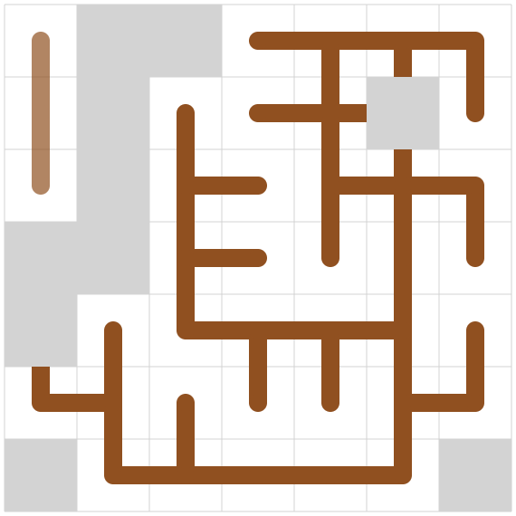

# AtCoder Heuristic Contest 011

`N^2 - 1`スライディングパズルを完成させる問題。T回以内の操作で完成できることは保証されている。
できるだけ操作回数が少ないと点数が高い。

## Run
```
cargo run --release --bin ahc011-a < a.in
```

## 得点について
得点の上限を考えると、`5*10^5 * 2`が上界の一つ。プレテストは50ケースなので`5*10^7`くらいが順位表で見られる最大値くらい。ただし、操作回数0でこの点数なのでありえない点数。1ケースあたり`5*10^5 * 1.5`くらいを順位表の上で取れてくるのかな？

操作回数N^3回で全部解けたとして、順位表で見るのは`3.75*10^7`くらい？
開始4時間くらいで`38M`が出てる……

`25M`出したい。

## Visualizer
Visualizerで最初は遊ぶ。


N＝6,seed0における解。

```
RRDDRRDDLLLUULLUUURRDLLURDDRDLLDDRRRURDLLLLUURRDDLULUUUURDDRRUULLLDDRRUULDDRULDLDDRRRRRDLUURDLUUUULLDRURDDDDDLLLLUUUURRDLULDRULDDRRRURDLLLURRDLLURDLULDRULDRUURRRDLLLURRDLLURURDDLDLDRULDDRRRUUULULLDDDRUURRDRUULDDRUUULDDLUURDLDRDRUULDRUULDRULDDDRUULDLDRRUULDRULURDDLURDDLUURDLURDDLLDRUULDRULDRRUULDRULDDLLDRRULLDRRUULDRULDRRUULDLDLLDRRRDLLURRDLLLUURRRDLLLURRRDLLLUURRDLLDDRR
```

縦1列とか横1行まるまる使っちゃうのはもったいないっぽい。いやケースによらないか？

N=4,seed0の解
```
RDLLLURRDLLURRRDLLLURRDLDDLUUURRDDDLLURRDRUULLURDRULDDLDRULUURRDDLLURRULDDDRUULDDRULDRULUR
```

## 方針
頂点数`N^2 - 1`の木を見つける部分と、木を完成させるためのスライド操作の構築部分を分けて解く。

### 木を見つける。
たくさん見つけたい。多点スタートになるかな？

とりあえず一つ見つけるために、DFS or AHC002のような焼きなまし法。

05/29 DFSを書いた。 `N=6`で1.9分かかる。
```
 4  5  5  9  4  9 
12  9 12  3  8 10 
10  6  3  4 15 11 
 6  9  8  0  2 10 
 8 10 14 13 13 11 
 6  7  3  2  2  2 
```
next_poses.len = 34

### 目標の木を完成させる操作列の構築
N=6,seed0。366手。左上の外周から完成させていく。なんか下より得してるのはどこだ？
```
LDDDDRUULDRUULDRUULDRUULDRDDRUULDRUULDRRRDDDLUURDLUURDLUURDLURDLLURRRDLURDLLURDRDLURULDRULDLLDLLURRDDLUURDDLLURURDDLURDDLLURDDRRRRULLDRULLDRULLDRULLDRULDRRUULDDRULLDRULDRRULLDRRUUURDLUURDLURRDLURDRDLLLDRRULDRRULURDLUURDDLLLLURRRDLLURDLURDDLLURURDLURDDRDLURDLLURDLLURURDDLLURRRRDLURULDLURULDLURDLDRRUULDDDLURRDLURDLUURDDRUUULDDRUULDLDLDRRULLDRURDRUULLDRDRUULDDRUULDDR
```

412手。こんな感じで動作するアルゴリズムを実装したい。
```
DDDLDRUULDRUULDRUULDRUULDDDRDRUULDRUULDRUULDDDRRRDRUULDRUULDRUULDLURDLLURDRDRUULDLURDDRDLURDLUUURDDLUURDDLLLURDLLURDLLURDLDRRURDDLLURDLLURURRRULDDRULDDRULDDRULDRULLDRULLDRUURDDLULLDRRULLDRUUUURDDRULDRRUULDLDRULDRRULDLLDRULDRRULDRRULDRRUUULDDRUULDDLLLDRUULDRRRURDDLURDDLULDRULLDRULURDLURRDDLULLDRRULLDRUUURDLURDRRDLUURDLURDLLURDDLDRUULDRULDDRULDRRUUULDDRUULDLDLURDLDRULDRUURRDLLURRDLDRUULDRULDDRULDRULLDRRULLDRURD
```

05/31 右隅3x3以外をスライド操作で構築できるようになった
なったと思ったんですが、slide2がバグってそう
たぶんバグがとれた

TODO: こもりさんのやつの入力からのマンハッタン距離を取ったりする

6/1 3x3を実装 盤面をノードにしてBFS

### 前半パートの高速化
二部グラフに見える？辺の重みが2頂点間で決まるわけじゃないような
入力から木を生成する割当問題？うーん

DFSを枝刈りで早くする？

まだslide2のバグがあった -> 直した aをtar_bに持ってきた後にtar_aにbがあるとまずい

4x4全探索できそうじゃない？（意外と被りが多いので）
tiles2numをどうにかすれば

3x3を適用して、いい感じのを先に置いておく

3x3各地適用や4x4ができてもdfs高速化は必要だな（見つからなかったら結局1から探すので）

DFSの探索数を減らそうの会。

N = 6 seed=0の例

空きマスを囲んでるのは明らかに無理 -> 3x3で検知できるようにしたら count: 529097568 が count: 187586332 に減った

~~デッドスペースをbfsで検知にしたらもっと減った count: 5184893~~ ←これはバグってた

というか今空きマスは右下としていたんだった


すみません N=7のseed=0でDFSが走らないんですが　なんで？

is_empty_spaceがめっちゃ仕事してるっぽい

```
7 686
4559000
04d3000
4d30000
0698000
0067980
00006b0
0000000
```

returnじゃなくてcontinueだ

N=6 seed=0でcount: 30148790

DFSの次の手をマンハッタン距離で短い奴にするやつ4,50秒かかる

count: 98324885 314手
```
URDLLURDDRULDRUULDRURRDLLURDDRUULDRRULDDDDRUULDRUULDRUULDLLLLDRDLDDRUULDRRDLLURRUURDDLULDRDLLURUURULDRRRRDLLURDLLURULDRRULDRURDDDLDRULDRUULDRUULDRUULDRDDDLUURDLUURDLURDLLURDLLURDLLURDDLURRDRDLLURDLLURRRRUULDDRULDRDLLURDLLURDLLURURRDLLURULDDRRULDRUULDDRRULDRUULDDRULDRUULDRDLLURDLLURDDLURRDLURDLLURRURDLLDRRUULLDRDR
```
DFS高速化したい

最初に何個か置いとく -> 時間で区切る 早く見つかるやつを焼きなまし

あれ N=5 seed=3でバグった
またslide2っぽいな
バグ取れた 2回に限定したがforで回す必要があった

2secくらいで終わった　なんで！？
N = 7 seed = 6 count: 4256941
```
LLDLLURRDLLDRRULDRRUULDDRRRRDLLURDLLURULDRUULDRURDRULDLLLDRRULDRRULDRRUULDLLLDLLURRDRDLLURDLLURDLDRDDRUULDLURRDDLURDLLURRUUUURDDLURDDLURDDLULDRDLLURURUULDRUULDRRRDLLURULDDRDLURDRUULDRUULDLLDRRULDRRULDRRUULDLDDRUULDLURDLLURRDDLURDLLURDDDRUULDLURDRULDRDLLURUUURDDLURDDLURDDLLURUURULDRRURDDDDLURDRUULDRUULDRUULDLLDRRULDRRUULDDLLURDLLURRRDRDLLURDLLURDLLURRDDLURDLLURRDLURDLLURURRDLLURULDRRRDLLURULDDRRUULDDDRULDRUULDRUULDLDLURRRDDLURDLLURDLLURURDDLLURDRRULLDRRULURDLLDRR
```

1secくらいで終わった うおおお　なんで？2
N = 6 seed = 10 count: 2696182
```
UULURDRRDLLURULDRURRRDLLURDLLURDDDRULDRUULDRUULDLDRRULDRRUULDDDRUULDRUULDLLDLLURRRRDRULDRDLLURDLLURDLLURDLLURDDDRUULDLURDRDLLURRULDRDLLURDRUULDRUULDRUULDRURDRURDLDRULDRUULDLDLLURDLDRUURDDLURDDLLURDLURURULDRRULDDRRUULDDDRUULDRUULDLLDRURDDLLURDLURURDLDRRULURDLLURDRD
```

N=5 seed=12でバグった 明日直す
最初はout.push('U')の後に、実際のtile入れ替え処理入れ忘れてた
bを左に動かすときにout.push('L')してた 'R'が正しい
slide3x3で経路復元するときにno entry found for key　これは大体slide2が悪い

気づきました
slide2の前処理でbを1個上げたりしたときに、逆にbが1個上がることがあってまずい
slide2をがっつり書き換えた方がいいかも
```
----ea
.....b <-ここのbを下げようとして
....b. <-ここのbは上がってしまう
```

即BAにできる場合を覗いて、Bをいったん排除しきりたい
排除する場所はtar_b.0 + 1,tar_b.1 - 1に近い場所
```
----ea
|....b
|...b.
```
を
```
----ea
|.bb..
|.....
```
こんな感じにしたい

bの移動先はfixしてなくて、危険な場所(eaとその下2個のところ)じゃないとこを
```rust
for i in 0..n {
    for j in (0..n).rev() {}
}
```
の順で探せばよいかな

6/3

全部bを排除するのは難しい

必勝パターンに持って行きたい

N=5 seed=12で上手くいくようになった 感動

あ～～～～～～～～
slide2でa = bの場合を考えていなかった なるほど 前処理なしでええか？
↑前処理した

N=5 seed=13でパリティチェックの必要性を感じた
今までは運が良かったのか？

よかったっぽい。あと別のところでバグった

N=5 seed=1でparity check falseなのに完成する うーん複数枚あるからだろうな

また別のバグを発見 slide2 下三角 green2 aもbもある場合

6/4
N = 5 seed = 27でバグった slide2の同じ数字がある場合 上三角のときと下三角のときで場合分けしてなかった 直した

parity check falseで完成しないやつを見つけたい 

TODO:ちゃんと検出できてそうであればdfsのところにparity checkを入れる

その前にまたバグがあったN=5 seed=29 slide2の同じ文字があった場合 場合分けが雑だった 直した

### だいたいslide2が直ったので今度こそ高速化
N=5 seed37めっちゃ時間かかる 10.1s
N=5 seed38のが時間かかるな 35s
N=5 seed40 9.4s
```
UUURDLLURDLDRRUULDLDRRULDRRUULDDRRULURDDDLLLLDRRULDRRULDRRULURDLUURDLUURDLLDLDLURRDDLULDRURDLURDLLURDRRRULLDRULDRUULDRUULDDRRULDRUULDDLURDRUULDDDRULURDLLURDDLURDR
```
N=5 seed42 11.5s
```
ULDLLURDDRRDLLURULDRUULDRDLURDRUULDDLDRRULURDRUULDDLURDRUULDLDLURDDLLURRDDLURDLLURRRULDRDLLURDLLURRRDLLURULDRUULDRDLURDRUULDRDLURDRUULDDDRUULDRUULDLDLURRDDRULLDRULLDRRRULDLUURDLDRULURRDLLDRR
```

一番個数が多いタイルを適当に配置する
配置したらタイルの開いている方向の点を、DFSの開始点に含めておく

角に置くのも有効そう
一番数の多い1|2|4|8のどれかとか

N=5 seed47 25.4sかかるし作るのも失敗 <-ちゃんとparity checkでfalseするようになった

constructをdfsの中でやって、parity checkをやる3x3で

N=5 seed=73 33.8s
```
UDLLURDLLURDDDRRRDLLURDLLURULDRUULDRUULDRDRUULDDRDLDRRULURDLUURDLUURDLLLLDRDDRUULDLURRDDLLURRDLLURRUULDRRURDLDDLLURURDDLLURRDRULURDLULDRDLURDR
```

N=5 seed47も作れるようになった！！！！！！！！！！！！！！！！！！！！！！
31.4s
```
DLLURULDDLDRRULURDRUULDRRULDRDLUURDLLDLLURRRDRULDRDLLURDLLURDLLURDRULDRDLLURURURDRULDDDRUULDRUULDRDLLURDLLURDRULDRDLLURRRDLLUURDRULDDRUULDLURRDD
```

### あとはもう本当に高速化だけ
- 一番個数が多いタイルを適当に配置する
- 配置したらタイルの開いている方向の点を、DFSの開始点に含めておく

N=6seed0が45sでcountが98324885だったのがどうなるだろう？
やべー終わらなくなった

上手く置かないと逆効果だったりするな
1つの木にならないこともある
閉路ができて終わってる

すみません　閉路ができたら検出できるようにしませんか？

N=6seed0の2,4に15を置いたら状態数が減った count: 98324885 -> count: 53655506

さらに3,1に7を置くと全然終わらなかった　なんで？ これなし

どういうところに何を置くと効くんだ？

4,2に11を置くともう少し減った count: 32880732

3,5に0 count: 18556994

~~0,3に13 count: 68868803 増えたが？~~ これなし

閉路ができそうなのを置くと増えそう？

2,4に15　4,2に11　3,5に0　に加えて、
1,4と1,2に8を置いたらcount: 786601 374msになった うおおおおおお可能性ある！！！！

2,4に15と1,4と1,2に8でcount: 996201の580ms これだ！！！！！！！

2,4に15と1,4に8でcount: 1860712の823ms マジでこれだ！！！！！！！

十字の周り(tile:15)はいくつかふさいだ方がいい？？全部空けておくと閉路になりがち
端に近い場合 卍みたいなのでふさいでおくのもアリ

あれ？1,4に8だけでcount: 2056446の1055msだな　これがクリティカルに効いてるのか？でも探索過程を見ているとtile:15の位置が決まっているので、これが決まってかつどこかふさいでるのが効いてるっぽい

N=5 seed73 count: 98324885に↑の方針で十字を置いてみる

N=5 seed73 count: 1047050に減った…！！！！！！！！！！！！！！！！

N=7 seed1みたいに十字がない場合もある
できるだけ次数の大きいタイルを決め打つ
探索の枝を減らすことが大事なので

N=5 seed55も十字がないぞ
(0,3)に13を置くことでcount: 82251からcount: 7757に減らせた

N=7 seed=1も14分くらい終わらなかったのが、
0,5に13を置くことで1927msになった ただし閉路が合って全体が連結でない

0,0から探索してるので、列0においても効かない 0,0から離れたところで上手く置く

0,2に13置いたらいい感じの木になった！！！！！
count: 4451411 2226ms

**次数が大きい奴を盤面の右半分あたりに置いて行って、探索を打ち切るコードを書く**
**得点の高い奴を採用**

閉路検出は↑が終わったら！！

なんか挙動が変わった
N=5 seed=73が何も置いていないとcount: 103290794 40.5s
3,2に15でcount: 30356646 13.7s
2,1に7も置いてcount: 24278437 11.3s

Timerを導入する

すみません　たぶん全然答えを出力してくれていません

### もっと高速化する　あと閉路検出をする
閉路ができるのはどんなと～きだ？

### 閉路検出もした　あとはもう本当に木を見つけるのを早くするだけ
ウオオオオオ　もう24時間ない！
割と早く終わるseed(N=6)
- 0
- 2
- 11
- 18
- 42

DFS自体の枝刈りを増やす

開いている数見て、木にならない局面を早期return

どこにも行けなくなったら今置いたマスが全体の連結成分として1つになっているか確認すべきでは？

こういうのの左上



確認するis_connectedを実装 でも遅くなって木が見つからないかも…？

やっぱりもう少し置いて決め打たないとなあ

is_connected使いません

1万回くらいやって返ってきたやつ何個か破壊するのどう？

元々のinput.nを固定するとかでもいいかもしれない（scoreが高くなるので）

うーん今日は寝るか 明日が最終日

6/5

8:27 起きた

次数3以上を固定して、失敗したらずらしていく

失敗盤面のfalseを返したposを記録していけるとよい？（失敗のフィードバックを得たい）

N=10 seed0で次数3をいじってるとき不可能がたまにある　なんで？

動かす前なのでdfs前の固定がまずそう

14:13

REが2つ local test する

17:27

ラストスパート

fixしても意味ない 残した奴を移動させる

17:11のを出して終わり！