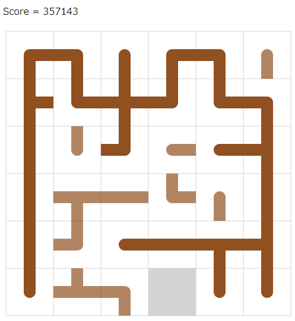

# AtCoder Heuristic Contest 011

`N^2 - 1`スライディングパズルを完成させる問題。T回以内の操作で完成できることは保証されている。
できるだけ操作回数が少ないと点数が高い。

## Run
```
cargo run --release --bin ahc011-a < a.in
```

## 得点について
得点の上限を考えると、`5*10^5 * 2`が上界の一つ。プレテストは50ケースなので`5*10^7`くらいが順位表で見られる最大値くらい。ただし、操作回数0でこの点数なのでありえない点数。1ケースあたり`5*10^5 * 1.5`くらいを順位表の上で取れてくるのかな？

操作回数N^3回で全部解けたとして、順位表で見るのは`3.75*10^7`くらい？
開始4時間くらいで`38M`が出てる……

`25M`出したい。

## Visualizer
Visualizerで最初は遊ぶ。



N＝6,seed0における解。

```
RRDDRRDDLLLUULLUUURRDLLURDDRDLLDDRRRURDLLLLUURRDDLULUUUURDDRRUULLLDDRRUULDDRULDLDDRRRRRDLUURDLUUUULLDRURDDDDDLLLLUUUURRDLULDRULDDRRRURDLLLURRDLLURDLULDRULDRUURRRDLLLURRDLLURURDDLDLDRULDDRRRUUULULLDDDRUURRDRUULDDRUUULDDLUURDLDRDRUULDRUULDRULDDDRUULDLDRRUULDRULURDDLURDDLUURDLURDDLLDRUULDRULDRRUULDRULDDLLDRRULLDRRUULDRULDRRUULDLDLLDRRRDLLURRDLLLUURRRDLLLURRRDLLLUURRDLLDDRR
```

縦1列とか横1行まるまる使っちゃうのはもったいないっぽい。いやケースによらないか？

N=4,seed0の解
```
RDLLLURRDLLURRRDLLLURRDLDDLUUURRDDDLLURRDRUULLURDRULDDLDRULUURRDDLLURRULDDDRUULDDRULDRULUR
```

## 方針
頂点数`N^2 - 1`の木を見つける部分と、木を完成させるためのスライド操作の構築部分を分けて解く。

### 木を見つける。
たくさん見つけたい。多点スタートになるかな？

とりあえず一つ見つけるために、DFS or AHC002のような焼きなまし法。

05/29 DFSを書いた。 `N=6`で1.9分かかる。
```
 4  5  5  9  4  9 
12  9 12  3  8 10 
10  6  3  4 15 11 
 6  9  8  0  2 10 
 8 10 14 13 13 11 
 6  7  3  2  2  2 
```
next_poses.len = 34

### 目標の木を完成させる操作列の構築
N=6,seed0。366手。左上の外周から完成させていく。なんか下より得してるのはどこだ？
```
LDDDDRUULDRUULDRUULDRUULDRDDRUULDRUULDRRRDDDLUURDLUURDLUURDLURDLLURRRDLURDLLURDRDLURULDRULDLLDLLURRDDLUURDDLLURURDDLURDDLLURDDRRRRULLDRULLDRULLDRULLDRULDRRUULDDRULLDRULDRRULLDRRUUURDLUURDLURRDLURDRDLLLDRRULDRRULURDLUURDDLLLLURRRDLLURDLURDDLLURURDLURDDRDLURDLLURDLLURURDDLLURRRRDLURULDLURULDLURDLDRRUULDDDLURRDLURDLUURDDRUUULDDRUULDLDLDRRULLDRURDRUULLDRDRUULDDRUULDDR
```

412手。こんな感じで動作するアルゴリズムを実装したい。
```
DDDLDRUULDRUULDRUULDRUULDDDRDRUULDRUULDRUULDDDRRRDRUULDRUULDRUULDLURDLLURDRDRUULDLURDDRDLURDLUUURDDLUURDDLLLURDLLURDLLURDLDRRURDDLLURDLLURURRRULDDRULDDRULDDRULDRULLDRULLDRUURDDLULLDRRULLDRUUUURDDRULDRRUULDLDRULDRRULDLLDRULDRRULDRRULDRRUUULDDRUULDDLLLDRUULDRRRURDDLURDDLULDRULLDRULURDLURRDDLULLDRRULLDRUUURDLURDRRDLUURDLURDLLURDDLDRUULDRULDDRULDRRUUULDDRUULDLDLURDLDRULDRUURRDLLURRDLDRUULDRULDDRULDRULLDRRULLDRURD
```

05/31 右隅3x3以外をスライド操作で構築できるようになった
なったと思ったんですが、slide2がバグってそう
たぶんバグがとれた

TODO: こもりさんのやつの入力からのマンハッタン距離を取ったりする

6/1 3x3を実装 盤面をノードにしてBFS

### 前半パートの高速化
二部グラフに見える？辺の重みが2頂点間で決まるわけじゃないような
入力から木を生成する割当問題？うーん

DFSを枝刈りで早くする？

まだslide2のバグがあった -> 直した aをtar_bに持ってきた後にtar_aにbがあるとまずい

4x4全探索できそうじゃない？（意外と被りが多いので）
tiles2numをどうにかすれば

3x3を適用して、いい感じのを先に置いておく

3x3各地適用や4x4ができてもdfs高速化は必要だな（見つからなかったら結局1から探すので）