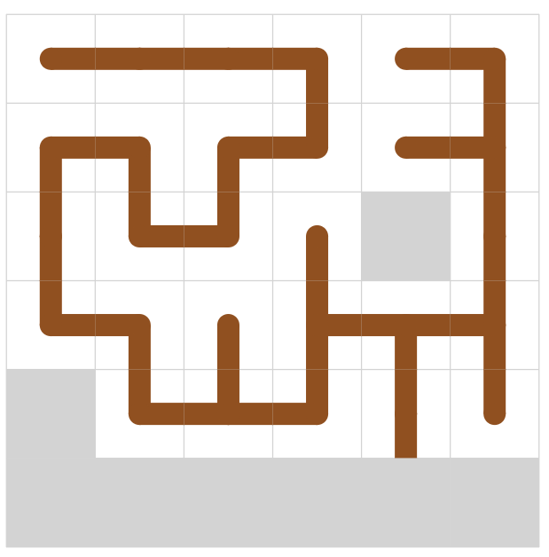

# AtCoder Heuristic Contest 011

`N^2 - 1`スライディングパズルを完成させる問題。T回以内の操作で完成できることは保証されている。
できるだけ操作回数が少ないと点数が高い。

## Run
```
cargo run --release --bin ahc011-a < a.in
```

## 得点について
得点の上限を考えると、`5*10^5 * 2`が上界の一つ。プレテストは50ケースなので`5*10^7`くらいが順位表で見られる最大値くらい。ただし、操作回数0でこの点数なのでありえない点数。1ケースあたり`5*10^5 * 1.5`くらいを順位表の上で取れてくるのかな？

操作回数N^3回で全部解けたとして、順位表で見るのは`3.75*10^7`くらい？
開始4時間くらいで`38M`が出てる……

`25M`出したい。

## Visualizer
Visualizerで最初は遊ぶ。


N＝6,seed0における解。

```
RRDDRRDDLLLUULLUUURRDLLURDDRDLLDDRRRURDLLLLUURRDDLULUUUURDDRRUULLLDDRRUULDDRULDLDDRRRRRDLUURDLUUUULLDRURDDDDDLLLLUUUURRDLULDRULDDRRRURDLLLURRDLLURDLULDRULDRUURRRDLLLURRDLLURURDDLDLDRULDDRRRUUULULLDDDRUURRDRUULDDRUUULDDLUURDLDRDRUULDRUULDRULDDDRUULDLDRRUULDRULURDDLURDDLUURDLURDDLLDRUULDRULDRRUULDRULDDLLDRRULLDRRUULDRULDRRUULDLDLLDRRRDLLURRDLLLUURRRDLLLURRRDLLLUURRDLLDDRR
```

縦1列とか横1行まるまる使っちゃうのはもったいないっぽい。いやケースによらないか？

N=4,seed0の解
```
RDLLLURRDLLURRRDLLLURRDLDDLUUURRDDDLLURRDRUULLURDRULDDLDRULUURRDDLLURRULDDDRUULDDRULDRULUR
```

## 方針
頂点数`N^2 - 1`の木を見つける部分と、木を完成させるためのスライド操作の構築部分を分けて解く。

### 木を見つける。
たくさん見つけたい。多点スタートになるかな？

とりあえず一つ見つけるために、DFS or AHC002のような焼きなまし法。

05/29 DFSを書いた。 `N=6`で1.9分かかる。
```
 4  5  5  9  4  9 
12  9 12  3  8 10 
10  6  3  4 15 11 
 6  9  8  0  2 10 
 8 10 14 13 13 11 
 6  7  3  2  2  2 
```
next_poses.len = 34

### 目標の木を完成させる操作列の構築
N=6,seed0。366手。左上の外周から完成させていく。なんか下より得してるのはどこだ？
```
LDDDDRUULDRUULDRUULDRUULDRDDRUULDRUULDRRRDDDLUURDLUURDLUURDLURDLLURRRDLURDLLURDRDLURULDRULDLLDLLURRDDLUURDDLLURURDDLURDDLLURDDRRRRULLDRULLDRULLDRULLDRULDRRUULDDRULLDRULDRRULLDRRUUURDLUURDLURRDLURDRDLLLDRRULDRRULURDLUURDDLLLLURRRDLLURDLURDDLLURURDLURDDRDLURDLLURDLLURURDDLLURRRRDLURULDLURULDLURDLDRRUULDDDLURRDLURDLUURDDRUUULDDRUULDLDLDRRULLDRURDRUULLDRDRUULDDRUULDDR
```

412手。こんな感じで動作するアルゴリズムを実装したい。
```
DDDLDRUULDRUULDRUULDRUULDDDRDRUULDRUULDRUULDDDRRRDRUULDRUULDRUULDLURDLLURDRDRUULDLURDDRDLURDLUUURDDLUURDDLLLURDLLURDLLURDLDRRURDDLLURDLLURURRRULDDRULDDRULDDRULDRULLDRULLDRUURDDLULLDRRULLDRUUUURDDRULDRRUULDLDRULDRRULDLLDRULDRRULDRRULDRRUUULDDRUULDDLLLDRUULDRRRURDDLURDDLULDRULLDRULURDLURRDDLULLDRRULLDRUUURDLURDRRDLUURDLURDLLURDDLDRUULDRULDDRULDRRUUULDDRUULDLDLURDLDRULDRUURRDLLURRDLDRUULDRULDDRULDRULLDRRULLDRURD
```

05/31 右隅3x3以外をスライド操作で構築できるようになった
なったと思ったんですが、slide2がバグってそう
たぶんバグがとれた

TODO: こもりさんのやつの入力からのマンハッタン距離を取ったりする

6/1 3x3を実装 盤面をノードにしてBFS

### 前半パートの高速化
二部グラフに見える？辺の重みが2頂点間で決まるわけじゃないような
入力から木を生成する割当問題？うーん

DFSを枝刈りで早くする？

まだslide2のバグがあった -> 直した aをtar_bに持ってきた後にtar_aにbがあるとまずい

4x4全探索できそうじゃない？（意外と被りが多いので）
tiles2numをどうにかすれば

3x3を適用して、いい感じのを先に置いておく

3x3各地適用や4x4ができてもdfs高速化は必要だな（見つからなかったら結局1から探すので）

DFSの探索数を減らそうの会。

N = 6 seed=0の例

空きマスを囲んでるのは明らかに無理 -> 3x3で検知できるようにしたら count: 529097568 が count: 187586332 に減った

~~デッドスペースをbfsで検知にしたらもっと減った count: 5184893~~ ←これはバグってた

というか今空きマスは右下としていたんだった



すみません N=7のseed=0でDFSが走らないんですが　なんで？

is_empty_spaceがめっちゃ仕事してるっぽい

```
7 686
4559000
04d3000
4d30000
0698000
0067980
00006b0
0000000
```

returnじゃなくてcontinueだ

N=6 seed=0でcount: 30148790

DFSの次の手をマンハッタン距離で短い奴にするやつ4,50秒かかる

count: 98324885 314手
```
URDLLURDDRULDRUULDRURRDLLURDDRUULDRRULDDDDRUULDRUULDRUULDLLLLDRDLDDRUULDRRDLLURRUURDDLULDRDLLURUURULDRRRRDLLURDLLURULDRRULDRURDDDLDRULDRUULDRUULDRUULDRDDDLUURDLUURDLURDLLURDLLURDLLURDDLURRDRDLLURDLLURRRRUULDDRULDRDLLURDLLURDLLURURRDLLURULDDRRULDRUULDDRRULDRUULDDRULDRUULDRDLLURDLLURDDLURRDLURDLLURRURDLLDRRUULLDRDR
```
DFS高速化したい

最初に何個か置いとく -> 時間で区切る 早く見つかるやつを焼きなまし

あれ N=5 seed=3でバグった
またslide2っぽいな
バグ取れた 2回に限定したがforで回す必要があった

2secくらいで終わった　なんで！？
N = 7 seed = 6 count: 4256941
```
LLDLLURRDLLDRRULDRRUULDDRRRRDLLURDLLURULDRUULDRURDRULDLLLDRRULDRRULDRRUULDLLLDLLURRDRDLLURDLLURDLDRDDRUULDLURRDDLURDLLURRUUUURDDLURDDLURDDLULDRDLLURURUULDRUULDRRRDLLURULDDRDLURDRUULDRUULDLLDRRULDRRULDRRUULDLDDRUULDLURDLLURRDDLURDLLURDDDRUULDLURDRULDRDLLURUUURDDLURDDLURDDLLURUURULDRRURDDDDLURDRUULDRUULDRUULDLLDRRULDRRUULDDLLURDLLURRRDRDLLURDLLURDLLURRDDLURDLLURRDLURDLLURURRDLLURULDRRRDLLURULDDRRUULDDDRULDRUULDRUULDLDLURRRDDLURDLLURDLLURURDDLLURDRRULLDRRULURDLLDRR
```

1secくらいで終わった うおおお　なんで？2
N = 6 seed = 10 count: 2696182
```
UULURDRRDLLURULDRURRRDLLURDLLURDDDRULDRUULDRUULDLDRRULDRRUULDDDRUULDRUULDLLDLLURRRRDRULDRDLLURDLLURDLLURDLLURDDDRUULDLURDRDLLURRULDRDLLURDRUULDRUULDRUULDRURDRURDLDRULDRUULDLDLLURDLDRUURDDLURDDLLURDLURURULDRRULDDRRUULDDDRUULDRUULDLLDRURDDLLURDLURURDLDRRULURDLLURDRD
```

N=5 seed=12でバグった 明日直す
最初はout.push('U')の後に、実際のtile入れ替え処理入れ忘れてた
bを左に動かすときにout.push('L')してた 'R'が正しい
slide3x3で経路復元するときにno entry found for key　これは大体slide2が悪い

気づきました
slide2の前処理でbを1個上げたりしたときに、逆にbが1個上がることがあってまずい
slide2をがっつり書き換えた方がいいかも
```
----ea
.....b <-ここのbを下げようとして
....b. <-ここのbは上がってしまう
```

即BAにできる場合を覗いて、Bをいったん排除しきりたい
排除する場所はtar_b.0 + 1,tar_b.1 - 1に近い場所
```
----ea
|....b
|...b.
```
を
```
----ea
|.bb..
|.....
```
こんな感じにしたい

bの移動先はfixしてなくて、危険な場所(eaとその下2個のところ)じゃないとこを
```rust
for i in 0..n {
    for j in (0..n).rev() {}
}
```
の順で探せばよいかな

6/3

全部bを排除するのは難しい

必勝パターンに持って行きたい

N=5 seed=12で上手くいくようになった 感動

あ～～～～～～～～
slide2でa = bの場合を考えていなかった なるほど 前処理なしでええか？
↑前処理した

N=5 seed=13でパリティチェックの必要性を感じた
今までは運が良かったのか？

よかったっぽい。あと別のところでバグった

N=5 seed=1でparity check falseなのに完成する うーん複数枚あるからだろうな

また別のバグを発見 slide2 下三角 green2 aもbもある場合